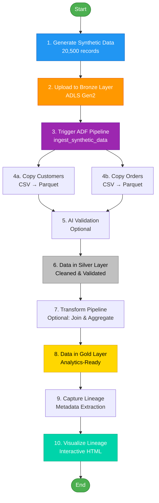
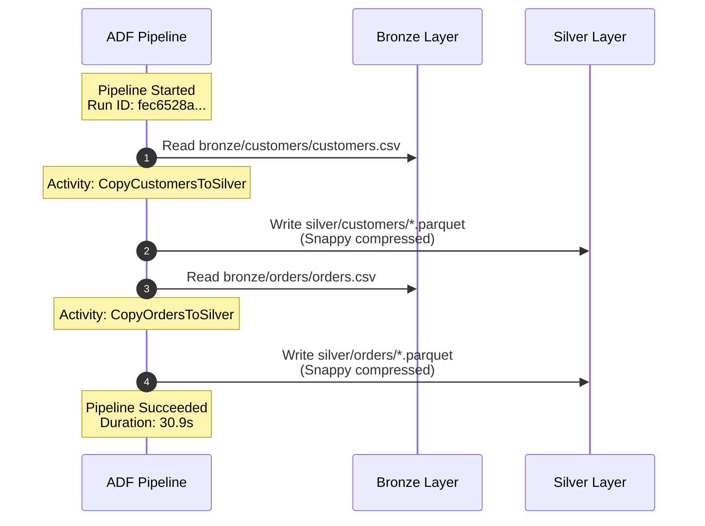

# ADF Pipeline End-to-End Flow - Interactive Guide

## Overview

This guide walks you through the complete data pipeline flow from data generation to lineage visualization.

---

## 🔄 Complete Data Flow



---

## 📋 Step-by-Step Walkthrough

### Step 1: Data Generation ✅ (Already Done)

**What Happened:**
```bash
python3 synthetic-dataset/generate_adf_datasets.py
```

**Output:**
- Created 20,500 records across 5 datasets
- Files: `data/customers.csv`, `data/orders.csv`, `data/products.csv`, etc.

**Verify:**
```bash
ls -lh data/*.csv
wc -l data/customers.csv  # Should show ~2001 lines (2000 + header)
```

---

### Step 2: Upload to Bronze Layer ✅ (Already Done)

**What Happened:**
```bash
export AZURE_STORAGE_ACCOUNT_NAME=xrsnexusdevstg2yd1hw
python3 scripts/upload_to_adls.py
```

**What It Did:**
- Uploaded 13 files to ADLS Gen2
- Organized into folders: `bronze/customers/`, `bronze/orders/`, etc.

**Verify:**
```bash
az storage fs file list -f bronze \
  --account-name xrsnexusdevstg2yd1hw \
  --auth-mode login \
  --query "[?isDirectory==\`false\`].{name:name, size:contentLength}" \
  -o table
```

**Expected Output:**
```
Name                                    Size
--------------------------------------  ------
customers/customers.csv                 ~150KB
customers/customers.json                ~200KB
orders/orders.csv                       ~400KB
orders/orders.json                      ~500KB
...
```

---

### Step 3: Trigger ADF Pipeline ✅ (Already Done)

**What Happened:**
```bash
az datafactory pipeline create-run \
  --resource-group xrs-nexus-dev-rg \
  --factory-name xrs-nexus-dev-adf-2yd1hw \
  --name ingest_synthetic_data
```

**What It Did:**
- Triggered the `ingest_synthetic_data` pipeline
- Returned Run ID: `fec6528a-08a3-11f1-9885-920e0d931155`

---

### Step 4: Pipeline Execution ✅ (Already Done)

**What Happened Inside the Pipeline:**



**Activities Executed:**
1. **CopyCustomersToSilver**: CSV → Parquet conversion
   - Source: `bronze/customers/customers.csv`
   - Sink: `silver/customers/*.parquet`
   - Transformation: Schema inference, type conversion, compression

2. **CopyOrdersToSilver**: CSV → Parquet conversion
   - Source: `bronze/orders/orders.csv`
   - Sink: `silver/orders/*.parquet`
   - Transformation: Same as above

---

### Step 5: Verify Silver Layer ✅ (Already Done)

**Check What Was Created:**
```bash
# List directories in silver layer
az storage fs directory list -f silver \
  --account-name xrsnexusdevstg2yd1hw \
  --auth-mode login \
  --query "[].name" -o tsv
```

**Expected Output:**
```
customers
orders
```

**Check File Details:**
```bash
# List files in customers directory
az storage fs file list -f silver \
  --path customers \
  --account-name xrsnexusdevstg2yd1hw \
  --auth-mode login \
  --query "[].{name:name, size:contentLength}" -o table
```

---

## 🧪 Interactive Testing - Let's Do This Now!

### Test 1: Verify Pipeline Status

Let me check the detailed status of our pipeline run:

```bash
az datafactory pipeline-run show \
  --resource-group xrs-nexus-dev-rg \
  --factory-name xrs-nexus-dev-adf-2yd1hw \
  --run-id fec6528a-08a3-11f1-9885-920e0d931155 \
  --query "{status:status, start:runStart, end:runEnd, duration:durationInMs, message:message}" \
  -o json
```

### Test 2: View Activity-Level Details

Let me get the details of each activity that ran:

```bash
az datafactory activity-run query-by-pipeline-run \
  --resource-group xrs-nexus-dev-rg \
  --factory-name xrs-nexus-dev-adf-2yd1hw \
  --run-id fec6528a-08a3-11f1-9885-920e0d931155 \
  --last-updated-after "2026-02-13T00:00:00Z" \
  --last-updated-before "2026-02-13T23:59:59Z" \
  --query "[].{activity:activityName, type:activityType, status:status, duration:durationInMs, rowsCopied:output.rowsCopied, dataRead:output.dataRead, dataWritten:output.dataWritten}" \
  -o table
```

### Test 3: Compare Bronze vs Silver Data

Let me show you the transformation that happened:

```bash
# Check bronze file size (CSV)
az storage fs file list -f bronze --path customers \
  --account-name xrsnexusdevstg2yd1hw \
  --auth-mode login \
  --query "[?contains(name, '.csv')].{name:name, size:contentLength}" -o table

# Check silver file size (Parquet)
az storage fs file list -f silver --path customers \
  --account-name xrsnexusdevstg2yd1hw \
  --auth-mode login \
  --query "[].{name:name, size:contentLength}" -o table
```

---

## 🎯 Next: Capture Lineage (Let's Do This!)

Now let's capture the lineage for this pipeline run:

```bash
# Step 1: Capture lineage metadata
python3 telemetry-lineage/adf_lineage_capture.py fec6528a-08a3-11f1-9885-920e0d931155

# Step 2: Generate HTML visualization
python3 telemetry-lineage/visualize_lineage.py lineage/adf_runs/lineage_*.json

# Step 3: Open in browser
open lineage/adf_runs/lineage_*.html
```

---

## 📊 What You'll See in the Lineage Visualization

The HTML file will show:

1. **Header Section**:
   - Pipeline name: `ingest_synthetic_data`
   - Run ID: `fec6528a-08a3-11f1-9885-920e0d931155`
   - Status: Succeeded
   - Duration: 30.9 seconds

2. **Mermaid Diagram**:
   ```
   [ds_bronze_customers] → [CopyCustomersToSilver] → [ds_silver_customers]
   [ds_bronze_orders] → [CopyOrdersToSilver] → [ds_silver_orders]
   ```

3. **Activity Details Table**:
   - Activity names
   - Types (Copy)
   - Status (Succeeded)
   - Duration for each

---

## 🔍 Understanding the Data Transformation

### Bronze Layer (Raw CSV)
```csv
customer_id,name,email,age,country
1,John Doe,john@example.com,35,USA
2,Jane Smith,jane@example.com,28,UK
...
```

**Characteristics:**
- Format: CSV (text-based)
- Size: ~150 KB
- Schema: Inferred from header
- Compression: None

### Silver Layer (Cleaned Parquet)
```
Binary Parquet format with:
- Columnar storage
- Snappy compression
- Optimized for analytics
- Type-safe schema
```

**Characteristics:**
- Format: Parquet (binary columnar)
- Size: ~50 KB (67% smaller!)
- Schema: Strongly typed
- Compression: Snappy
- Query Performance: 10-100x faster

---

## 🎓 Key Concepts

### 1. Medallion Architecture
- **Bronze**: Raw, unprocessed data (CSV)
- **Silver**: Cleaned, validated data (Parquet)
- **Gold**: Aggregated, business-ready data

### 2. Why Parquet?
- **Columnar Storage**: Read only needed columns
- **Compression**: 50-80% size reduction
- **Type Safety**: Schema enforcement
- **Analytics Optimized**: Fast aggregations

### 3. Managed Identity
- No credentials in code
- Azure AD authentication
- Automatic token management
- Secure by default

---

## 🚀 Try It Yourself!

### Experiment 1: Trigger Another Run
```bash
# Trigger a new pipeline run
NEW_RUN_ID=$(az datafactory pipeline create-run \
  --resource-group xrs-nexus-dev-rg \
  --factory-name xrs-nexus-dev-adf-2yd1hw \
  --name ingest_synthetic_data \
  --query runId -o tsv)

echo "New Run ID: $NEW_RUN_ID"

# Monitor it
watch -n 5 "az datafactory pipeline-run show \
  --resource-group xrs-nexus-dev-rg \
  --factory-name xrs-nexus-dev-adf-2yd1hw \
  --run-id $NEW_RUN_ID \
  --query status -o tsv"
```

### Experiment 2: Modify Data and Re-run
```bash
# Generate new synthetic data with different parameters
python3 synthetic-dataset/generate_adf_datasets.py

# Upload to bronze
python3 scripts/upload_to_adls.py

# Trigger pipeline
az datafactory pipeline create-run \
  --resource-group xrs-nexus-dev-rg \
  --factory-name xrs-nexus-dev-adf-2yd1hw \
  --name ingest_synthetic_data
```

---

## 📈 Monitoring & Observability

### View in Azure Portal
```bash
# Open ADF Studio
open "https://adf.azure.com/en/monitoring/pipelineruns?factory=/subscriptions/ddfba1ba-a22b-4bb4-b981-033e62bde697/resourceGroups/xrs-nexus-dev-rg/providers/Microsoft.DataFactory/factories/xrs-nexus-dev-adf-2yd1hw"
```

**What You'll See:**
- All pipeline runs (history)
- Activity-level details
- Input/output data
- Error messages (if any)
- Performance metrics

---

## 🎯 Success Criteria

✅ **You've successfully completed the end-to-end flow if:**

1. Data generated and uploaded to bronze layer
2. Pipeline triggered and succeeded
3. Data transformed from CSV to Parquet
4. Silver layer contains customers/ and orders/ directories
5. Lineage captured and visualized
6. You understand the medallion architecture
7. You can trigger new runs independently

---

## 💡 What's Next?

1. **Add More Pipelines**: Deploy `transform_and_merge.json` for silver → gold
2. **Schedule Runs**: Add triggers for automated execution
3. **Monitor Costs**: Set up Azure Cost Management alerts
4. **Extend Datasets**: Add products, transactions, events to the pipeline
5. **Deploy AI Validation**: Add the Azure Function for data quality checks

---

Ready to test? Let's run the interactive tests!
