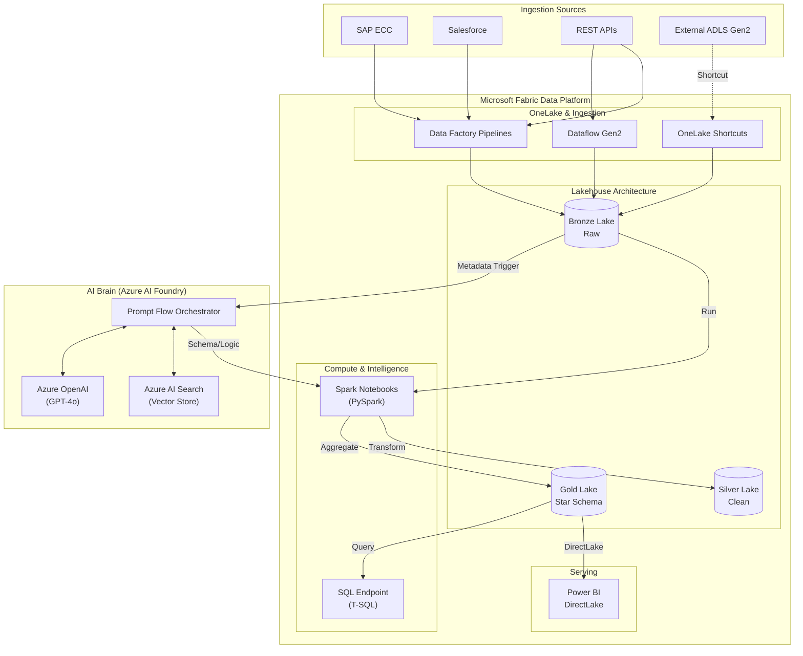

# XRS NEXUS: Enterprise AI-Driven Integration Platform

## 1. Platform Overview

**XRS NEXUS** is an Azure-native, metadata-driven, AI-orchestrated integration platform for XRS Group UK. It revolutionizes how enterprise data is ingested, processed, and governed by replacing static ETL pipelines with dynamic, AI-generated integration flows.

The platform ingests metadata from 15+ heterogeneous enterprise systems (SAP, Salesforce, REST APIs, etc.), normalizes it into a canonical model, and uses **Azure AI Foundry (Prompt Flow + RAG)** to automatically generate and execute ETL/ELT pipelines on **Microsoft Fabric**.

---

## 2. Key Features & AI Capabilities

### 🧠 Core AI Brain (Azure AI Foundry)
We leverage **Azure AI Foundry** to orchestrate intelligent workflows using **Prompt Flow** and **GPT-4o**.

| Feature | Description | AI Technology |
|---------|-------------|---------------|
| **Intelligent Schema Mapping** | Auto-maps source fields to target schemas using historical patterns. | **RAG (Azure AI Search)** + Prompt Flow |
| **PII Detection & Governance** | Scans data payloads to identify and tag Sensitive/Confidential info. | **Prompty** + GPT-4o |
| **Automated Error Resolution** | Analyzes stack traces and error logs to suggest root causes and fixes. | Prompt Flow + **Self-Correction** |
| **SLA Breach Prediction** | Predicts pipeline runtime based on volume and historical telemetry. | Predictive AI (LLM-based) |
| **Natural Language to SQL** | Converts business questions ("Total sales in UK") into SparkSQL. | **NL2SQL** Prompt Flow |
| **Natural Language DQ Rules** | Converts English rules ("Revenue must be positive") into Python assertions. | **Prompty** + Data Quality |
| **Impact Analysis** | Generates human-readable reports on downstream impact of schema changes. | Lineage Graph + GenAI Summarization |

---

## 3. Technology Stack & Architecture

### Core Azure Services
| Service | Role |
|:--------|:-----|
| **Azure AI Foundry** | Unified platform for building and managing AI solutions (Hub & Projects). |
| **Azure OpenAI** | Provides LLM models (GPT-4o) and Embeddings for intelligence. |
| **Azure AI Search** | Vector Store and Retrieval engine for RAG (Schema Mapping). |
| **Prompt Flow** | Orchestration tool for linking LLMs, Python code, and data tools. |
| **Microsoft Fabric** | Unified data platform for Lakehouse storage and Spark compute. |
| **Terraform** | Infrastructure as Code (IaC) for reproducible deployments. |

### End-to-End Workflow
The platform operates in a continuous loop of **Listen -> Think -> Act**.

1.  **Ingest (Listen)**:
    *   Metadata is ingested from SAP/Salesforce into the **Bronze Lakehouse**.
    *   The **Metadata Intelligence Agent** scans this for new schema definitions.
2.  **Orchestrate (Think)**:
    *   **Prompt Flow** triggers a RAG lookup in **Azure AI Search** to find historical mapping patterns.
    *   **GPT-4o** analyzes the new fields and suggests a normalized schema.
    *   **Prompty** scans sample data for PII and tags it for governance.
3.  **Execute (Act)**:
    *   A dynamic **Spark Job** is generated and submitted to **Microsoft Fabric**.
    *   Data flows from Bronze -> Silver -> Gold tiers.
4.  **Monitor (Observe)**:
    *   Telemetry is logged to **Application Insights**.
    *   **SLA Agent** predicts completion times and alerts on breach risks.

### Architecture Diagram


---

## 4. Microsoft Fabric Components

The project includes a comprehensive set of **Microsoft Fabric** artifacts to demonstrate a complete enterprise analytics solution.

| Component | Path | Description |
|:----------|:-----|:------------|
| **Lakehouse** | `/fabric/lakehouse/` | Bronze/Silver/Gold structures, DDLs, and table registration. |
| **Pipelines** | `/fabric/pipelines/` | Data Factory pipelines for orchestration and ingestion. |
| **Dataflows** | `/fabric/dataflows/` | Gen2 Dataflows for low-code transformation and mapping. |
| **OneLake** | `/fabric/onelake/` | Shortcuts to external ADLS/S3 and cross-workspace links. |
| **Notebooks** | `/fabric/notebooks/` | PySpark notebooks for Bronze->Silver->Gold ETL and DQ checks. |
| **SQL Endpoint** | `/fabric/sql/` | T-SQL scripts for analytics and NL2SQL validation. |
| **Power BI** | `/fabric/powerbi/` | Semantic models and report metadata for DirectLake. |
| **Governance** | `/fabric/governance/` | Lineage extraction and monitoring configurations. |

---

## 5. Comprehensive Deployment Guide

Follow these steps to deploy the platform from scratch.

### Step 1: Clone & Configure
1.  Clone the repository:
    ```bash
    git clone https://github.com/xps-group/xrs-nexus.git
    cd xrs-nexus
    ```
2.  Set up environment variables in a `.env` file (template provided below):
    ```ini
    AZURE_OPENAI_API_KEY=your_key
    AZURE_OPENAI_ENDPOINT=https://your-resource.openai.azure.com/
    AZURE_SEARCH_KEY=your_key
    AZURE_SEARCH_ENDPOINT=https://your-resource.search.windows.net/
    ```

### Step 2: Infrastructure Provisioning (Terraform)
We use Terraform to stand up the Azure AI and Data resources.
1.  Navigate to the infra directory:
    ```bash
    cd infra
    ```
2.  Initialize Terraform:
    ```bash
    terraform init
    ```
3.  Plan and Apply:
    ```bash
    terraform plan -out main.tfplan
    terraform apply main.tfplan
    ```
    *Note: In this repository Terraform provisions core low-cost resources (Resource Group, Storage account, Application Insights, and Azure Search). Microsoft Fabric workspace and Azure AI Foundry / Prompt Flow are NOT created automatically — they require tenant admin enablement and manual portal steps (see the runbooks in `/infra`).*

### PoC Infra Applied (Tenant Verification)

The following core resources have been provisioned and verified in the target subscription (examples from a verification run):

- **Resource Group:** xrs-nexus-dev-rg
- **Storage Account(s):** xrsnexusstg (and a secondary storage account `xrsnexusdevdc84ca6e`)
- **Log Analytics Workspace:** xrs-nexus-dev-law
- **Application Insights:** xrs-nexus-appi
- **Azure Cognitive Search:** xrs-nexus-dev-search (SKU: free)

You can verify these resources locally with the Azure CLI (example):

```bash
az group show -n xrs-nexus-dev-rg
az resource list -g xrs-nexus-dev-rg -o table
az storage account show -g xrs-nexus-dev-rg -n xrsnexusstg -o json
az search service show -g xrs-nexus-dev-rg -n xrs-nexus-dev-search -o json
az monitor app-insights component show -g xrs-nexus-dev-rg -n xrs-nexus-appi -o json
```

Next steps to complete the end-to-end PoC (manual actions required):

- Create a **Microsoft Fabric workspace** in the Azure portal or request tenant enablement for Fabric capacities.
- Create an **Azure AI Foundry / Prompt Flow project** in AI Studio (requires a portal action and appropriate subscription access).
- Once the Fabric workspace and Foundry/Prompt Flow project exist, run the provided import scripts in `/infra/import_promptflow.sh` to import flows from `ai-orchestration/flows/` (the scripts are dry-run safe; they require the Foundry/Prompt Flow admin endpoint and token).

See `/infra/README_PROVISIONING.md`, `/infra/foundry_runbook.md` and `/infra/promptflow_runbook.md` for detailed step-by-step guidance and tenant-runbook tasks.

### Step 3: Data Generation (Simulation)
Generate synthetic data to simulate a production workload for testing.
1.  Generate Metadata (Simulates SAP/Salesforce schemas):
    ```bash
    python3 synthetic-dataset/generate_metadata.py
    # Output: data/metadata_samples.json (1000+ records)
    ```
2.  Generate Telemetry (Simulates execution logs):
    ```bash
    python3 synthetic-dataset/generate_telemetry.py
    # Output: data/telemetry_logs.json (1000+ records)
    ```

### Step 4: RAG System Setup
Index the generated metadata into Azure AI Search to enable the "Intelligent Mapping" capability.
1.  Run the indexer script:
    ```bash
    python3 ai-orchestration/rag/indexer.py
    ```
    *This chunks the metadata descriptions, creates embeddings using OpenAI, and pushes them to the Vector Store.*

### Step 5: Executing AI Workflows
Now you can run the actual Prompt Flows.
1.  **Schema Mapping Flow**:
    ```bash
    # Test mapping a field 'KUNNR' (German for Customer Number in SAP)
    pf flow test --flow ai-orchestration/flows/schema_mapping --inputs source_field="KUNNR"
    ```
    pf flow test --flow ai-orchestration/flows/nl2sql --inputs user_question="Show total revenue for UK"
    ```

### Step 5.1: Executing Advanced Python SDK Flows
We have implemented 5 advanced use cases using the **Prompt Flow Python SDK**.
1.  **Multi-Source Schema Mapping** (Simulated RAG)
2.  **Context-Aware NL2SQL** (with Validation)
3.  **Intelligent PII Redaction** (Prompty-based)
4.  **Automated Error Root Cause Analysis** (Log Analysis)
5.  **Natural Language Data Quality Rules** (English to Python)

To run all these flows locally:
```bash
# Install dependencies
python3 -m pip install prompty promptflow-tools

# Run the master orchestration script
python3 ai-orchestration/setup_flows.py
```
    
### Step 6: Data Processing (Fabric/Spark Simulation)
Execute the Python scripts that simulate the Fabric Spark jobs.
1.  Process Bronze Layer (Ingestion):
    ```bash
    python3 etl-execution/spark_jobs/process_bronze.py
    ```
2.  Process Silver Layer (Transformation):
    ```bash
    python3 etl-execution/spark_jobs/process_silver.py
    ```

### Step 7: API Deployment
Deploy the Azure Function to expose the platform APIs.
1.  Navigate to the API folder:
    ```bash
    cd api-layer
    ```
2.  Start locally:
    ```bash
    func start
    ```

---

## 6. Advanced AI Use Cases & Execution Guide
This section details the 5 advanced Prompt Flow use cases implemented in the project, including their logic and how to test them.

### Use Case 1: Multi-Source Schema Mapping (RAG)
**Goal:** Map disparate fields from source systems (SAP, Salesforce) to the Enterprise Canonical Model.
**Logic:**
1.  **Retrieve:** Simulates searching a Vector Store (RAG) for field definitions in SAP/Salesforce dictionaries.
2.  **Resolve:** Uses GPT-4o to semantically match the source field to a target Canonical Field.
**Test Input:**
```json
{
  "source_field": "KUNNR",
  "source_system": "SAP"
}
```
**Expected Output:** Match `KUNNR` -> `CustomerID` with high confidence.

---

### Use Case 2: Context-Aware NL2SQL
**Goal:** Convert natural language business questions into executable SparkSQL.
**Logic:**
1.  **Schema Lookup:** Retrieves the schema for the requested table.
2.  **SQL Gen:** Prompty generates the SparkSQL query.
3.  **Validation:** Python tool validates syntax (e.g., ensures `SELECT` only, no `DROP`).
**Test Input:**
```json
{
  "question": "Show total sales by region",
  "table_name": "sales_data"
}
```
**Expected Output:** `SELECT region, SUM(amount) FROM sales_data GROUP BY region...`

---

### Use Case 3: Intelligent PII Redaction
**Goal:** Redact sensitive personal data while preserving business context.
**Logic:** Uses a Prompty to identify PII (Names, Emails) and replace them with tokens (`[PERSON]`, `[EMAIL]`) without removing non-sensitive IDs.
**Test Input:**
```json
{
  "text": "Please contact John Doe (john.doe@enterprise.com) regarding invoice #INV-2024-001."
}
```
**Expected Output:** `Please contact [PERSON] ([EMAIL]) regarding invoice #INV-2024-001.`

---

### Use Case 4: Automated Error Root Cause Analysis (RCA)
**Goal:** Diagnose Spark/Application errors from log traces.
**Logic:**
1.  **Retrieve:** Searches a "Known Error Database" for similar past issues.
2.  **Analyze:** LLM combines the log and context to suggest a Root Cause and Fix.
**Test Input:**
```json
{
  "error_log": "java.lang.OutOfMemoryError: Java heap space"
}
```
**Expected Output:** Suggests increasing `spark.executor.memory`.

---

### Use Case 5: Natural Language Data Quality Rules
**Goal:** Enable business users to define DQ rules in plain English.
**Logic:** Translates English requirements into Python `Great Expectations` syntax.
**Test Input:**
```json
{
  "rule": "Revenue must be positive."
}
```
**Expected Output:** `df.expect_column_values_to_be_between("revenue", min_value=0)`

---

## 7. Project Structure Reference

*   **`/ai-orchestration`**: The "Brain". Contains Prompt Flows, RAG scripts, and Prompty files.
*   **`/infra`**: The "Body". Terraform code to build the Azure environment.
*   **`/synthetic-dataset`**: The "Fuel". Scripts to generate large-scale test data.
*   **`/etl-execution`**: The "Muscle". Spark scripts that effectively transform the data.
*   **`/fabric`**: The "Platform". Integration artifacts for Microsoft Fabric (Lakehouse, Pipelines, Notebooks).