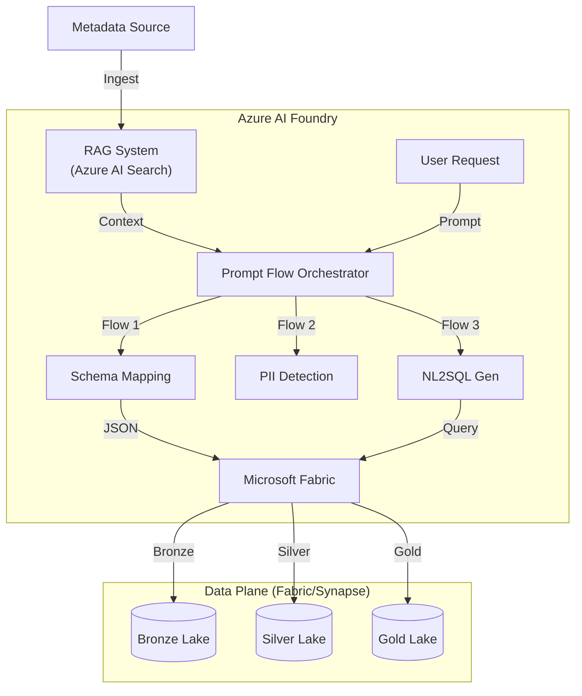
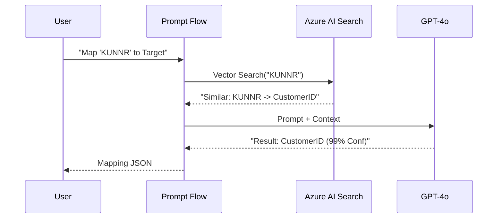

# XRS NEXUS: Enterprise AI-Driven Integration Platform

## 1. Platform Overview

**XRS NEXUS** is an Azure-native, metadata-driven, AI-orchestrated integration platform for XRS Group UK. It revolutionizes how enterprise data is ingested, processed, and governed by replacing static ETL pipelines with dynamic, AI-generated integration flows.

The platform ingests metadata from 15+ heterogeneous enterprise systems (SAP, Salesforce, REST APIs, etc.), normalizes it into a canonical model, and uses **Azure AI Foundry (Prompt Flow + RAG)** to automatically generate and execute ETL/ELT pipelines on **Microsoft Fabric**.

---

## 2. Key Features & AI Capabilities

### 🧠 Core AI Brain (Azure AI Foundry)
We leverage **Azure AI Foundry** to orchestrate intelligent workflows using **Prompt Flow** and **GPT-4o**.

| Feature | Description | AI Technology |
|---------|-------------|---------------|
| **Intelligent Schema Mapping** | Auto-maps source fields to target schemas using historical patterns. | **RAG (Azure AI Search)** + Prompt Flow |
| **PII Detection & Governance** | Scans data payloads to identify and tag Sensitive/Confidential info. | **Prompty** + GPT-4o |
| **Automated Error Resolution** | Analyzes stack traces and error logs to suggest root causes and fixes. | Prompt Flow + **Self-Correction** |
| **SLA Breach Prediction** | Predicts pipeline runtime based on volume and historical telemetry. | Predictive AI (LLM-based) |
| **Natural Language to SQL** | Converts business questions ("Total sales in UK") into SparkSQL. | **NL2SQL** Prompt Flow |
| **Impact Analysis** | Generates human-readable reports on downstream impact of schema changes. | Lineage Graph + GenAI Summarization |

---

## 3. Architecture Diagrams

### Overall AI Architecture
### Technologies


### Overall AI Architecture


### RAG & Design Pattern
We use a **Retrieval-Augmented Generation (RAG)** pattern to ground the AI model with specific enterprise context.

1.  **Ingestion**: Documentation and Metadata are chunked and indexed in **Azure AI Search**.
2.  **Retrieval**: When a mapping request comes in, we retrieve "similar past mappings" from the Vector Store.
3.  **Generation**: GPT-4o uses this context to propose a highly accurate mapping.



---

## 4. Beginner's Guide: How It Works Under the Hood

### Step 1: Metadata Ingestion
The system scans your sources (SAP, Salesforce) and generates a standardized JSON metadata file.
*   **Script**: `synthetic-dataset/generate_metadata.py`
*   **Output**: `data/metadata_samples.json`

### Step 2: Vector Indexing
This metadata is "embedded" (converted to vectors) and stored in **Azure AI Search** so the AI can "remember" it.
*   **Script**: `ai-orchestration/rag/indexer.py`

### Step 3: Prompt Flow Execution
When a Data Engineer creates a new pipeline, **Prompt Flow** runs a DAG (Directed Acyclic Graph) of AI tasks.
*   **Location**: `ai-orchestration/flows/`
*   **Example**: `schema_mapping/flow.dag.yaml`

### Step 4: Data Processing
The generated logic is executed on **Microsoft Fabric** (Spark) to move data from Bronze -> Silver -> Gold.
*   **Scripts**: `etl-execution/spark_jobs/`

---

## 5. Getting Started

### Prerequisites
*   Azure Subscription (AI Studio, OpenAI, Search).
*   Python 3.10+.
*   Terraform (for Infra).

### Installation & Setup

1.  **Infrastructure Deployment**
    Deploy the full Azure AI & Data stack using Terraform.
    ```bash
    cd infra
    terraform init
    terraform apply
    ```

2.  **Generate Data**
    Create synthetic datasets to simulate a production environment (1000+ records).
    ```bash
    python3 synthetic-dataset/generate_metadata.py
    python3 synthetic-dataset/generate_telemetry.py
    ```

3.  **Run AI Flows**
    You can run prompt flows locally using the `pf` CLI (requires `promptflow` package).
    ```bash
    # Install dependencies
    pip install promptflow promptflow-tools azure-search-documents azure-ai-ml

    # Run Schema Mapping Flow
    pf flow test --flow ai-orchestration/flows/schema_mapping --inputs source_field="KUNNR"
    ```

---

## 6. Project Structure

*   `/ai-orchestration`: Core AI logic.
    *   `/flows`: Prompt Flow definitions (DAGs).
    *   `/prompty`: Prompty assets.
    *   `/rag`: Indexing scripts.
*   `/infra`: Terraform code for Azure resources.
*   `/etl-execution`: Spark/Python data processing jobs.
*   `/synthetic-dataset`: Data generation scripts.
*   `/data`: Local storage for generated datasets.