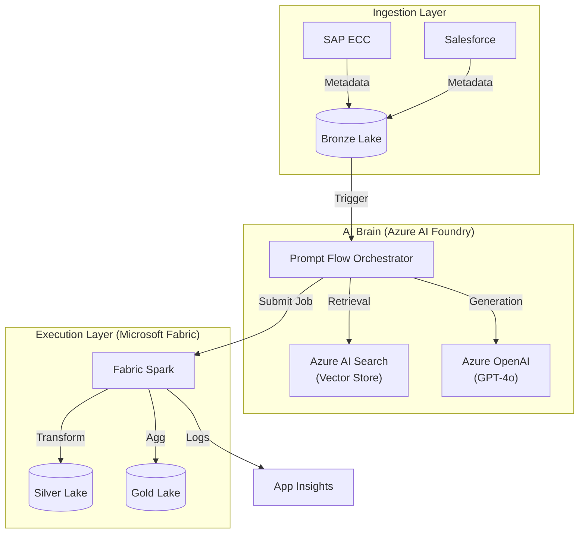

# XRS NEXUS: Enterprise AI-Driven Integration Platform

## 1. Platform Overview

**XRS NEXUS** is an Azure-native, metadata-driven, AI-orchestrated integration platform for XRS Group UK. It revolutionizes how enterprise data is ingested, processed, and governed by replacing static ETL pipelines with dynamic, AI-generated integration flows.

The platform ingests metadata from 15+ heterogeneous enterprise systems (SAP, Salesforce, REST APIs, etc.), normalizes it into a canonical model, and uses **Azure AI Foundry (Prompt Flow + RAG)** to automatically generate and execute ETL/ELT pipelines on **Microsoft Fabric**.

---

## 2. Key Features & AI Capabilities

### 🧠 Core AI Brain (Azure AI Foundry)
We leverage **Azure AI Foundry** to orchestrate intelligent workflows using **Prompt Flow** and **GPT-4o**.

| Feature | Description | AI Technology |
|---------|-------------|---------------|
| **Intelligent Schema Mapping** | Auto-maps source fields to target schemas using historical patterns. | **RAG (Azure AI Search)** + Prompt Flow |
| **PII Detection & Governance** | Scans data payloads to identify and tag Sensitive/Confidential info. | **Prompty** + GPT-4o |
| **Automated Error Resolution** | Analyzes stack traces and error logs to suggest root causes and fixes. | Prompt Flow + **Self-Correction** |
| **SLA Breach Prediction** | Predicts pipeline runtime based on volume and historical telemetry. | Predictive AI (LLM-based) |
| **Natural Language to SQL** | Converts business questions ("Total sales in UK") into SparkSQL. | **NL2SQL** Prompt Flow |
| **Impact Analysis** | Generates human-readable reports on downstream impact of schema changes. | Lineage Graph + GenAI Summarization |

---

## 3. Technology Stack & Architecture

### Core Azure Services
| Service | Role |
|:--------|:-----|
| **Azure AI Foundry** | Unified platform for building and managing AI solutions (Hub & Projects). |
| **Azure OpenAI** | Provides LLM models (GPT-4o) and Embeddings for intelligence. |
| **Azure AI Search** | Vector Store and Retrieval engine for RAG (Schema Mapping). |
| **Prompt Flow** | Orchestration tool for linking LLMs, Python code, and data tools. |
| **Microsoft Fabric** | Unified data platform for Lakehouse storage and Spark compute. |
| **Terraform** | Infrastructure as Code (IaC) for reproducible deployments. |

### End-to-End Workflow
The platform operates in a continuous loop of **Listen -> Think -> Act**.

1.  **Ingest (Listen)**:
    *   Metadata is ingested from SAP/Salesforce into the **Bronze Lakehouse**.
    *   The **Metadata Intelligence Agent** scans this for new schema definitions.
2.  **Orchestrate (Think)**:
    *   **Prompt Flow** triggers a RAG lookup in **Azure AI Search** to find historical mapping patterns.
    *   **GPT-4o** analyzes the new fields and suggests a normalized schema.
    *   **Prompty** scans sample data for PII and tags it for governance.
3.  **Execute (Act)**:
    *   A dynamic **Spark Job** is generated and submitted to **Microsoft Fabric**.
    *   Data flows from Bronze -> Silver -> Gold tiers.
4.  **Monitor (Observe)**:
    *   Telemetry is logged to **Application Insights**.
    *   **SLA Agent** predicts completion times and alerts on breach risks.

### Architecture Diagram


---

## 4. Comprehensive Deployment Guide

Follow these steps to deploy the platform from scratch.

### Step 1: Clone & Configure
1.  Clone the repository:
    ```bash
    git clone https://github.com/xps-group/xrs-nexus.git
    cd xrs-nexus
    ```
2.  Set up environment variables in a `.env` file (template provided below):
    ```ini
    AZURE_OPENAI_API_KEY=your_key
    AZURE_OPENAI_ENDPOINT=https://your-resource.openai.azure.com/
    AZURE_SEARCH_KEY=your_key
    AZURE_SEARCH_ENDPOINT=https://your-resource.search.windows.net/
    ```

### Step 2: Infrastructure Provisioning (Terraform)
We use Terraform to stand up the Azure AI and Data resources.
1.  Navigate to the infra directory:
    ```bash
    cd infra
    ```
2.  Initialize Terraform:
    ```bash
    terraform init
    ```
3.  Plan and Apply:
    ```bash
    terraform plan -out main.tfplan
    terraform apply main.tfplan
    ```
    *This creates the AI Hub, Project, Search Service, and Storage Accounts.*

### Step 3: Data Generation (Simulation)
Generate synthetic data to simulate a production workload for testing.
1.  Generate Metadata (Simulates SAP/Salesforce schemas):
    ```bash
    python3 synthetic-dataset/generate_metadata.py
    # Output: data/metadata_samples.json (1000+ records)
    ```
2.  Generate Telemetry (Simulates execution logs):
    ```bash
    python3 synthetic-dataset/generate_telemetry.py
    # Output: data/telemetry_logs.json (1000+ records)
    ```

### Step 4: RAG System Setup
Index the generated metadata into Azure AI Search to enable the "Intelligent Mapping" capability.
1.  Run the indexer script:
    ```bash
    python3 ai-orchestration/rag/indexer.py
    ```
    *This chunks the metadata descriptions, creates embeddings using OpenAI, and pushes them to the Vector Store.*

### Step 5: Executing AI Workflows
Now you can run the actual Prompt Flows.
1.  **Schema Mapping Flow**:
    ```bash
    # Test mapping a field 'KUNNR' (German for Customer Number in SAP)
    pf flow test --flow ai-orchestration/flows/schema_mapping --inputs source_field="KUNNR"
    ```
2.  **NL2SQL Flow**:
    ```bash
    # Test converting a question to SQL
    pf flow test --flow ai-orchestration/flows/nl2sql --inputs user_question="Show total revenue for UK"
    ```

### Step 6: Data Processing (Fabric/Spark Simulation)
Execute the Python scripts that simulate the Fabric Spark jobs.
1.  Process Bronze Layer (Ingestion):
    ```bash
    python3 etl-execution/spark_jobs/process_bronze.py
    ```
2.  Process Silver Layer (Transformation):
    ```bash
    python3 etl-execution/spark_jobs/process_silver.py
    ```

### Step 7: API Deployment
Deploy the Azure Function to expose the platform APIs.
1.  Navigate to the API folder:
    ```bash
    cd api-layer
    ```
2.  Start locally:
    ```bash
    func start
    ```

---

## 5. Project Structure Reference

*   **`/ai-orchestration`**: The "Brain". Contains Prompt Flows, RAG scripts, and Prompty files.
*   **`/infra`**: The "Body". Terraform code to build the Azure environment.
*   **`/synthetic-dataset`**: The "Fuel". Scripts to generate large-scale test data.
*   **`/etl-execution`**: The "Muscle". Spark scripts that effectively transform the data.