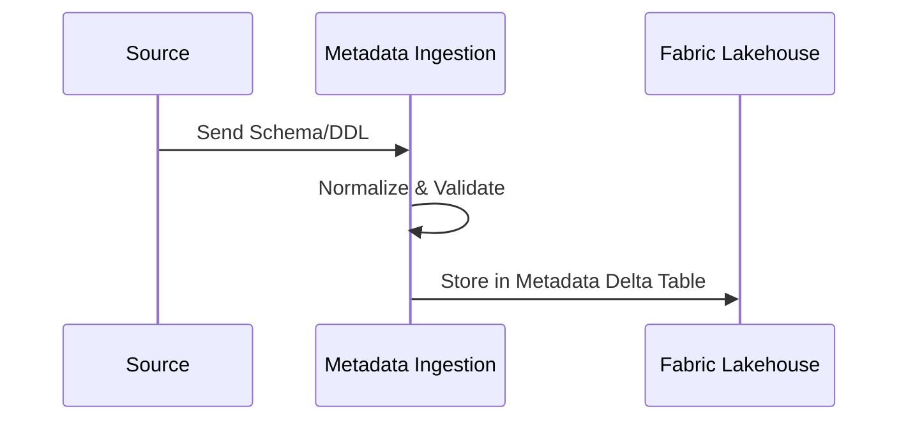
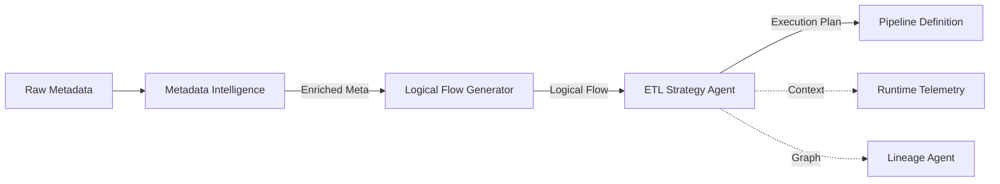
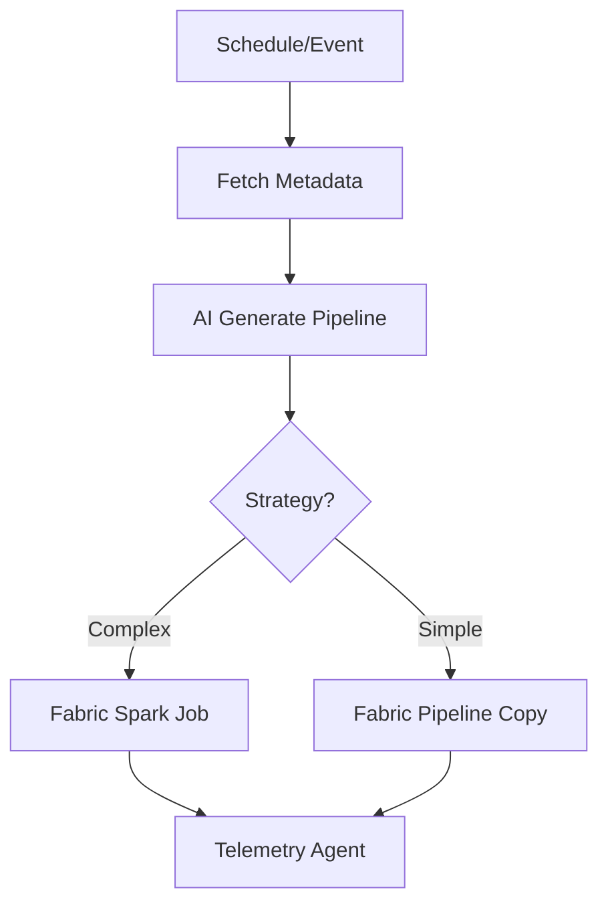
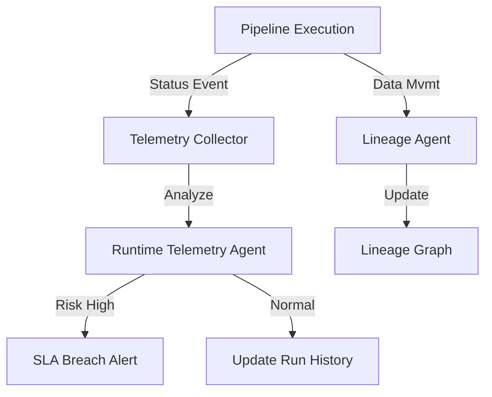

# XRS NEXUS: Enterprise AI-Driven Integration Platform

## 1. Platform Overview

**XRS NEXUS** is an Azure-native, metadata-driven, AI-orchestrated integration platform for XRS Group UK. It revolutionizes how enterprise data is ingested, processed, and governed by replacing static ETL pipelines with dynamic, AI-generated integration flows.

The platform ingests metadata from 15+ heterogeneous enterprise systems (SAP, Salesforce, REST APIs, etc.), normalizes it into a canonical model, and uses **Azure AI Foundry + Prompt Flow** to automatically generate and execute ETL/ELT pipelines on **Microsoft Fabric**.

**Key Differentiators:**
- **Zero-Code Integration:** Pipelines are generated at runtime by AI agents based on metadata and SLAs.
- **Multi-Agent Orchestration:** Specialized agents for Metadata Intelligence, Flow Generation, and Telemetry.
- **Fabric-Native:** Leverages OneLake (Bronze/Silver/Gold) and Spark for high-performance processing.
- **End-to-End Observability:** Real-time SLA tracking, lineage, and impact analysis.

---

## 2. Azure Services Used

| Service | Purpose | Integration Points | Runtime Role |
|---------|---------|-------------------|--------------|
| **Azure AI Foundry / Prompt Flow** | Orchestrates AI agents and logic generation. | Python SDK, OpenAI Models | **Brain:** Decides *how* to integrate data. |
| **Microsoft Fabric Lakehouse** | Centralized storage (OneLake) for data & metadata. | Delta Tables, Spark | **Storage:** System of Record (Bronze/Silver/Gold). |
| **Fabric Spark** | Distributed compute for heavy transformations. | Job Definitions, Notebooks | **Compute:** Executes complex data flows. |
| **Fabric Pipelines** | Orchestration of activities and copy jobs. | Pipeline JSON | **Orchestrator:** Manages execution sequencing. |
| **Azure Data Factory** | Legacy system integration (where needed). | IR, Connectors | **Connector:** Bridges on-prem/legacy gaps. |
| **Azure Functions** | API & Control Plane (Python). | HTTP Triggers | **API:** Exposes status/metrics to UI. |
| **Azure Application Insights** | Observability and distributed tracing. | Python Logger | **Observer:** Logs metrics & traces. |
| **Microsoft Entra ID** | Identity and Access Management. | App Registration | **Security:** RBAC & AuthZ. |

---

## 3. End-to-End Execution Flow

**Source → Metadata → AI Agents → Fabric → Telemetry → UI**

1.  **Metadata Ingestion:** The platform ingests technical and business metadata from sources (e.g., SAP tables, Salesforce objects).
2.  **AI Intelligence:** The **Metadata Intelligence Agent** normalizes this metadata, detecting system types and PII.
3.  **Flow Generation:** The **Logical Flow Generator Agent** creates a technology-agnostic integration plan (Extract -> Cleanse -> Load).
4.  **Pipeline Construction:** The **Pipeline Builder** converts the logical flow into a physical **Fabric Spark Job** or **ADF Pipeline**.
5.  **Execution & Telemetry:** The pipeline processes data while the **Runtime Telemetry Agent** monitors progress against SLAs.
6.  **Lineage & Impact:** The **Lineage Agent** updates the dependency graph for impact analysis.
7.  **UI Visualization:** Status APIs serve real-time metrics to the operations dashboard.

---

## 4. Architecture Diagrams

### Overall Architecture
```mermaid
flowchart TD
    Sources[Enterprise Sources\n(SAP, Salesforce, APIs)] -->|Metadata| Ingest[Metadata Ingestion]
    Ingest -->|Normalized JSON| AI[AI Orchestration\n(Prompt Flow)]
    
    subgraph "AI Brain"
        AI -->|Analyze| MIA[Metadata Intelligence Agent]
        MIA -->|Plan| LFA[Logical Flow Generator]
        LFA -->|Optimize| ESA[ETL Strategy Agent]
    end
    
    ESA -->|Definition| Build[Pipeline Builder]
    Build -->|Submit| Fabric[Microsoft Fabric]
    
    subgraph "Data Plane"
        Fabric -->|Spark/Copy| Bronze[(Bronze Lake)]
        Bronze -->|Transform| Silver[(Silver Lake)]
        Silver -->|Agg| Gold[(Gold Lake)]
    end
    
    Fabric -->|Logs| Telemetry[Runtime Telemetry]
    Telemetry -->|Metrics| API[Status API (Azure Func)]
    API -->|JSON| UI[Ops Dashboard]
```

### Metadata Ingestion Flow


### AI Multi-Agent Orchestration


### Dynamic ETL Execution


### Runtime Telemetry & Lineage


---

## 5. SAP CDC Example Walkthrough

**Scenario:** Ingesting `EKKO` (Purchasing Header) from SAP ECC with Change Data Capture (CDC).

1.  **Metadata Ingestion:**
    *   System detects `EKKO` table.
    *   Flags `CDC_Enabled = True`.
    *   SLA = 30 mins.

2.  **Logical Flow Generation:**
    *   **Agent Decision:** Use Incremental Load pattern.
    *   **Steps:**
        1.  Extract (SAP Connector, CDC Mode).
        2.  Transform (Cast types, Standardize dates).
        3.  Merge (Upsert into Silver Lakehouse based on Primary Key).

3.  **Pipeline Execution:**
    *   **Strategy Agent:** Selects **Fabric Spark** due to complex Merge requirement.
    *   **Builder:** Generates Spark definition with `spark.read.format("sap_cdc")` and `deltaTable.alias("t").merge(...)`.

4.  **Progress Calculation:**
    *   Telemetry Agent sees "Extract" took 5 mins.
    *   Predicts total time: 15 mins.
    *   **SLA Risk:** LOW (15 < 30).

5.  **UI JSON Output:**
    ```json
    {
      "run_id": "run_sap_ekko_001",
      "status": "RUNNING",
      "stage": "MERGE",
      "progress": 75,
      "sla_risk": "LOW"
    }
    ```

---

## 6. Getting Started

### Prerequisites
*   Azure Subscription with AI Foundry and Fabric enabled.
*   Python 3.10+.
*   Azure CLI.

### Installation
1.  **Clone Repository:**
    ```bash
    git clone https://github.com/XRS-group/xrs-nexus.git
    cd xrs-nexus
    ```
2.  **Generate Synthetic Data:**
    ```bash
    python synthetic-dataset/generate_metadata.py
    ```
3.  **Deploy AI Agents:**
    Ensure `promptflow` is installed and run tests:
    ```bash
    python ai-orchestration/metadata_intelligence.py
    ```
4.  **Deploy API:**
    ```bash
    cd api-layer
    func start
    ```

### Contact
For architecture queries, contact **Platform Engineering (platform@XRSgroup.co.uk)**.